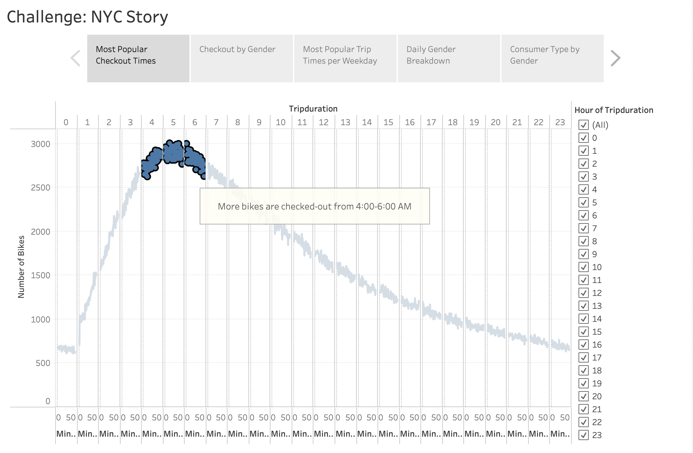
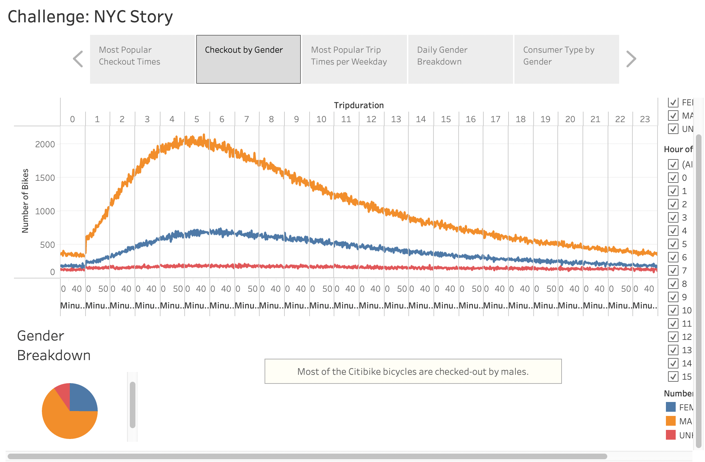
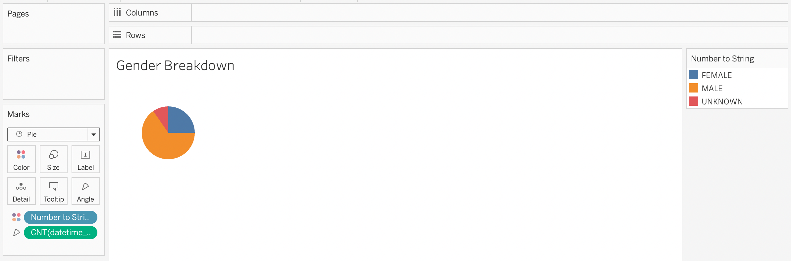
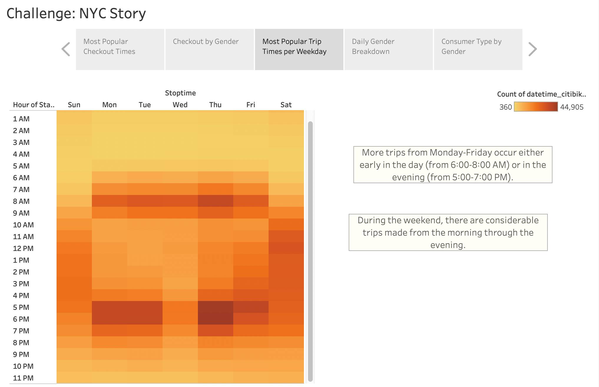
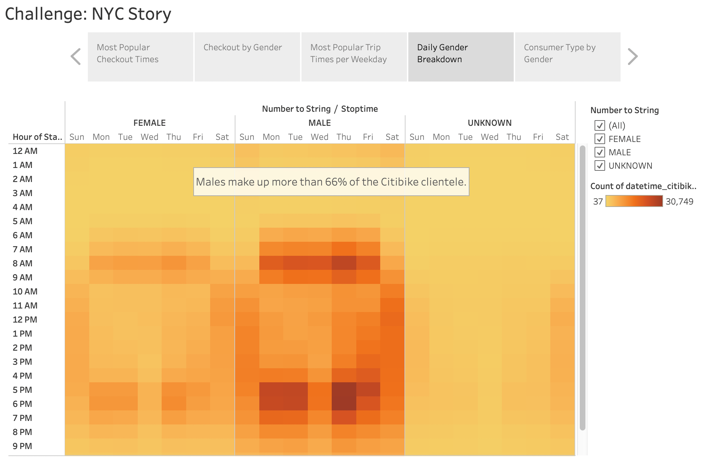
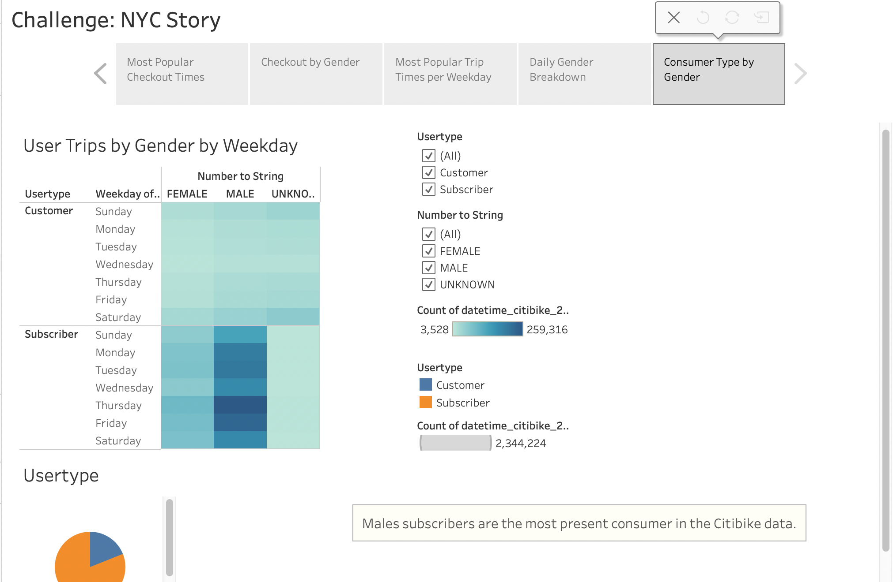
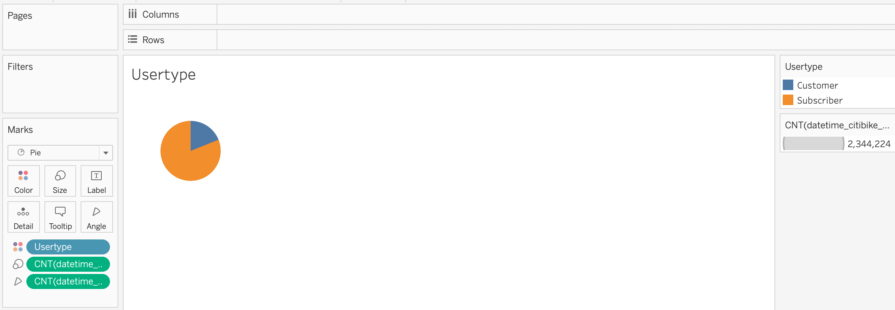

# bikesharing
Tableau

## Overview
Citibike allows tourists to explore New York City using bikesharing. In order to start a similar initiative in Des Moines, Iowa, an extensive ananylsis must be performed on the Citibike data from New York City. By using Tableau and a dataset contained in a flat CSV file, there is sufficient data suggesting consumer type, gender type, seasonal preferecne, houirly preference, and favored riding locating. 

With the information gathered in the primary study, investors in the Des Moines project will be provided with the first half of valuable information. In this initial analysis the data suggests an overwhelming use of bikesharing from subscribers over short-term customers, and males over females and other genders.August is the most popular month for bike riding and locations in and around Central Park are prefered by riders. 

The second half of the pitch will focus on the time of day most bikes are checked out and whether or not gender has an impact on the time. This will help find the best times to provide maintenece on the bicycles. We will see if there is a link between gender and consumer type when compared to prefered riding times and prefered riding days. In the end of the analysis we will find the most present type and gender of consumer in the Citibike data. 

## Results

### Checkout Times for Users
This line graph displays the number of bikes checked out by users continuously throughout the day. More bikes are rented during the early hours of 4:00-6:00 AM. This time period would be the worst to refurbish or perfrom maintenence on Citibikes. Most users come during those hours to rent bikes. 

### Checkout Times by Gender
This graph is similar to the first, however this time gender is considered to try and see whether or not it has an impact on checkout times throughout the day. According to the data, checkout times are higher during the same time period of 4:00-6:00 AM. In our gender breakdown we can confirm two-thirds of the users are males, the rest are females or unknown. 

### Trips by Weekday for Each Hour
Here we can see the most popular times do go on a trip from our users. The analysis confims more trips in the morning and in the evening from Monday-Friday. At the weekend, there are more trips during the morning and through the evening. 

### Trips by Gender (Weekday per Hour)
This visual confirms the most popular times each gender goes on a bike trip during each day in the week. We again see the most popular times in the morning being 6:00-8:00 AM, and in the evening being 5:00-7:00 PM. 

### User Trips by Gender by Weekday
This final analysis breaks down the preferred times by gender and by usertype (short-term customer or subscriber). We can conclude that the majority of our users are male subscribers. 

## Summary
We know know the potential customer breakdown and preferred locations and times for bike-riding in New York City. How does this translate to Des Moines Iowa? Well without having any data on Des Moines in our dataset we could research all of the popular sites in the city. Most users in New York City went on trips near Central Park. With this in mind we could do a further two analyses on age differentiation by location and group-oriented preferences. 

First: Are certain age groups attracted to specific sites? 
Second: Would families participate group-oreinted activities?

This will provide us with data that will best support our users. How would knowing about age groups and sites benefit our customers and our business? Varying age groups spend more-or-less time on their bike rides. Some sites will provide age-groups with the adequate distance/experice for their trip. If we can pinpoint these types of trips we can proivde our longer trips users with updated bikes, with gears and gps for example. 

Would families participate group-oreinted activities? If we could analyze whether our users came in groups of families or friends we could organize group-lead tours for bundle-packages. This could demand at least one subscription per family-member, increase annual profit. For example, if we bundled 3 families togehter for a tour of the Poppajohn Sculpture Park in Des Moines, we would add 3 subscribers plus a family bundle package for a tour of one of Iowas most vibrant, outdoor sites. 

